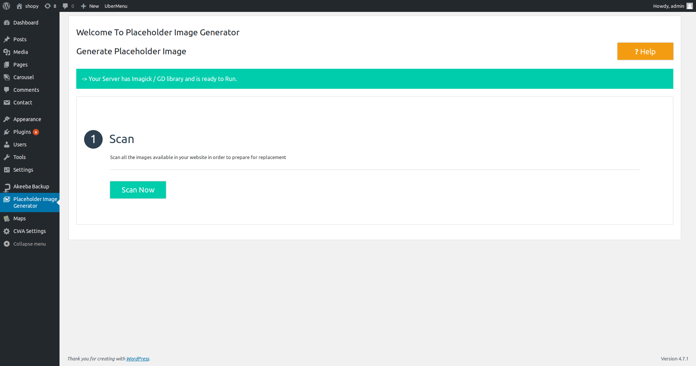
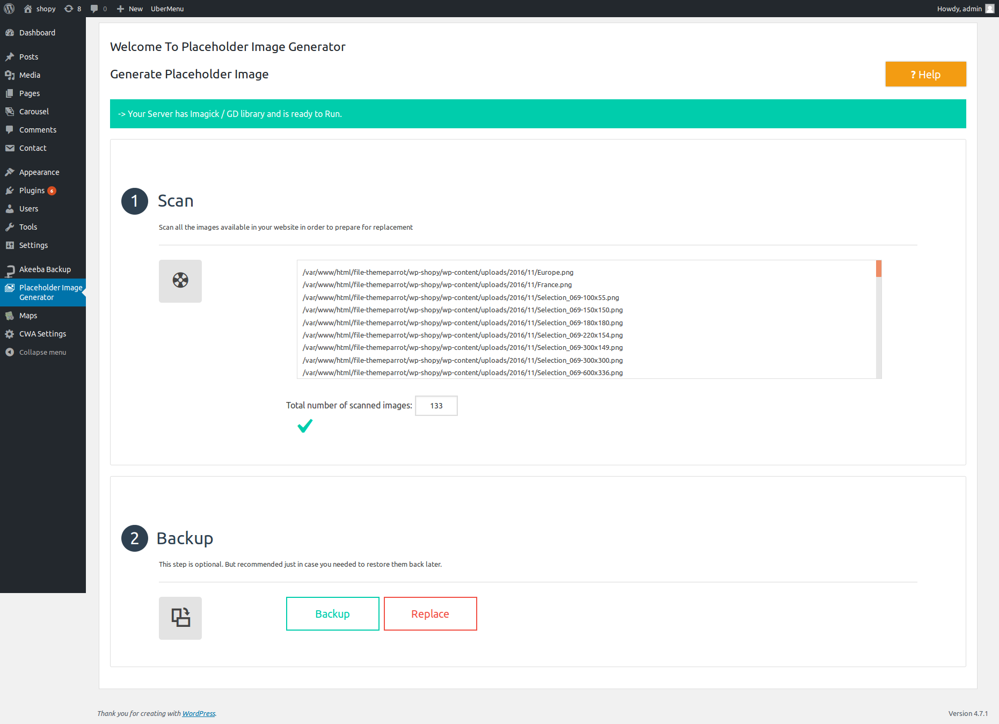
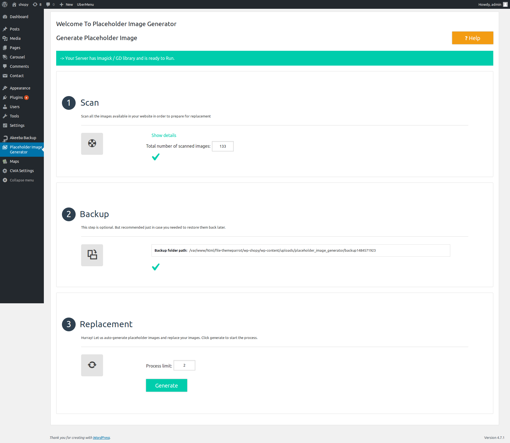
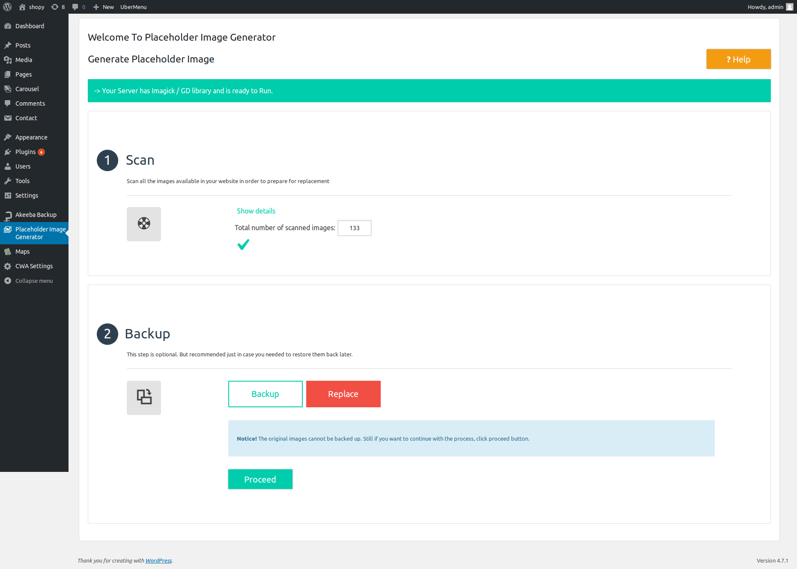
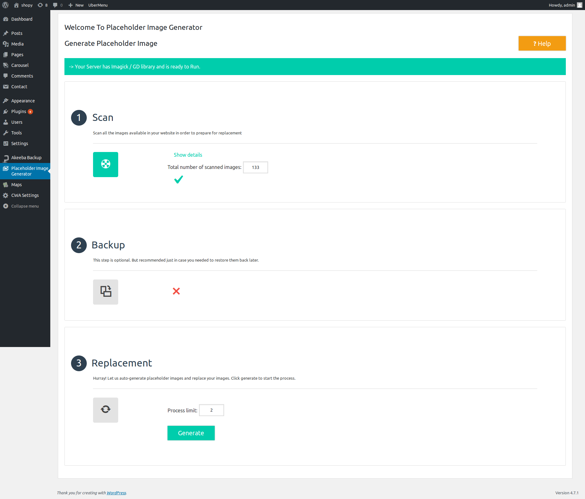
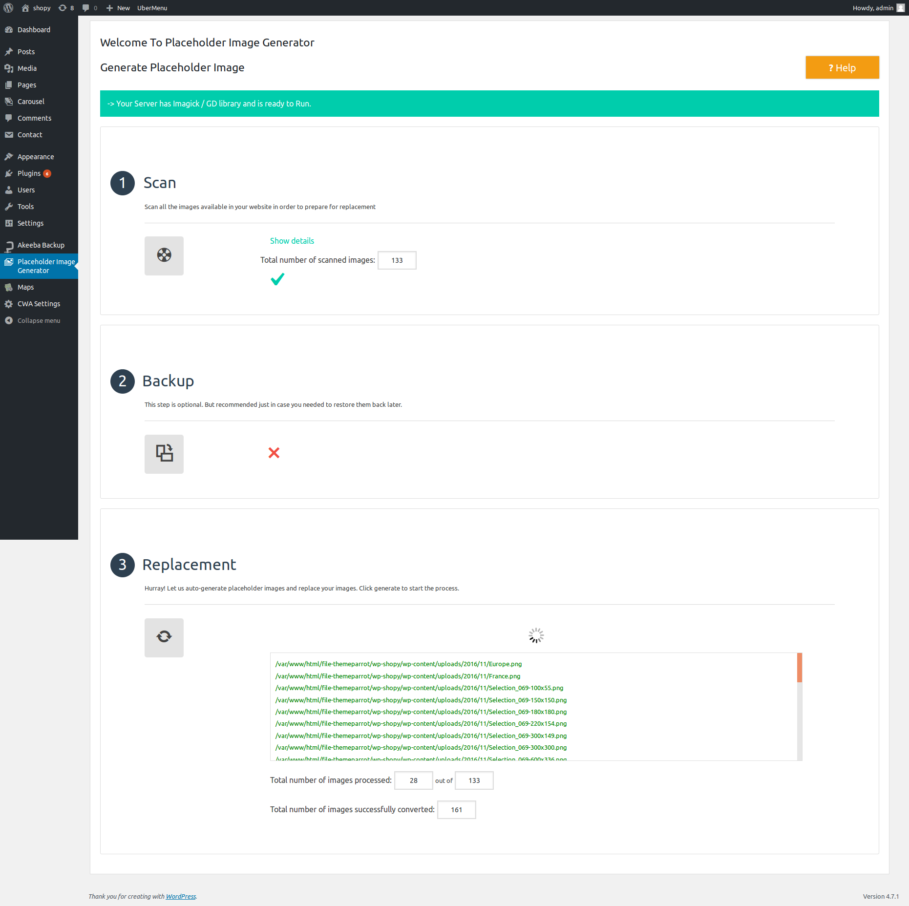

# Placeholder Image Generator

This plugin automatically generates placeholder images and replaces the original images of your upcoming template / website with placeholder image. The placeholder image also shows the resolution of image to be placed there.

```
You should have GD library and Imagick library support to use this plugin.
```

#### Requirements

1. PHP version 5.5 or higher
2. You should have atleast any one of below two library supports
  - **GD library**
  - **Imagick**
3. Wordpress 4.6 and above

#### Installation

1. Download and install Placeholder Image Generator plugin using wordpress plugin installer.
2. From Wordpress dashboard, go to Plugins > Installed Plugins and activate it.
3. After the plugin has been activated, you can see Placeholder Image Generator in wordress dashboard menu.

#### Generate placehoder image

1. From wordpress dashboard menu, click on Placeholder Image Generator to generate placeholder images.

2. After opening Placeholder Image Generator plugin, there is nothing difficult settings has to be configured.

3. It is step by step process and you will have to wait for a while since this process might take some time based on the images you have.

##### Step-1 Scan

After clicking on Scan Now button, the plugin starts to fetch images from the folder (i.e.) the plugin read images from folder. The resulted log shows you the images which are fetched or read from folder. See the screen shots below





##### Step-2 Backup / Replace

This step is optional.

After the plugin fetching images from folder and if you would like to take a Backup of original images, click Backup button. The plugin starts to create a backup and once finished taking backup, the resulted log shows you the path of backup folder. See the screenshot below



If you don't want to take back up, click on Replace button to proceed with step 3.





##### Step-3 Replacement

It asks you to enter the process limit and click Generate.

Finally, the plugin starts to generate placeholder images and replace the original image with placeholder. The resulted log shows you the images which are converted as placeholder images.



And at the end, you can also see the

1. Total number of images processed
2. Total number of images successfully converted

